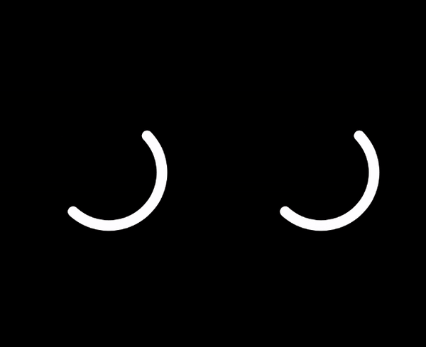

# SpinnerView

[](https://travis-ci.org/svdahlberg/SpinnerView)
[](http://cocoapods.org/pods/SpinnerView)
[](http://cocoapods.org/pods/SpinnerView)
[](http://cocoapods.org/pods/SpinnerView)

A material design like loading indicator with success and fail animations.



## Example

To run the example project, clone the repo, and run `pod install` from the Example directory first.

## Requirements

* iOS 9.3
* Swift 4.0

## Installation

SpinnerView is available through [CocoaPods](http://cocoapods.org). To install
it, simply add the following line to your Podfile:

```ruby
pod 'SpinnerView'
```

## Author

Svante Dahlberg, svante.dahlberg@gmail.com

## License

SpinnerView is available under the MIT license. See the LICENSE file for more info.
